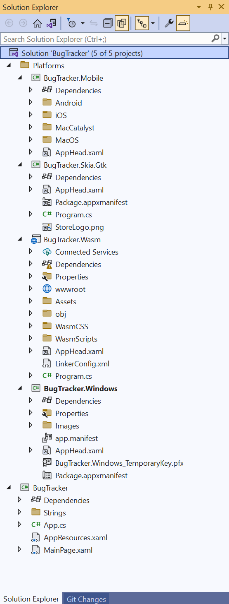

# Uno Platform app solution structure

This guide briefly explains the structure of an app created with the default [Uno Platform app template](https://marketplace.visualstudio.com/items?itemName=unoplatform.uno-platform-addin-2022). It's particularly aimed at developers who have not worked with cross-platform codebases before. 

## The project files in an Uno Platform app

After creating a new solution with the [Uno Platform App Template](https://marketplace.visualstudio.com/items?itemName=unoplatform.uno-platform-addin-2022) called `HelloWorld`, it will contain the following projects:

1. A `HelloWorld.[Platform].csproj` file for each platform that Uno Platform supports: Windows, Mobile (iOS/Android/Catalyst), Skia.Gtk, Skia.Wpf, Skia.Framebuffer, Server, and WebAssembly. These projects are known as **heads** for their respective platform. Those contain typical information like settings, metadata, dependencies, and also a list of files included in the project. The platform *head* builds and packages executable binaries for that platform. Each of these projects takes a reference from the project below.

2. A `HelloWorld.csproj` file. This **Class Library Project** generally contains most of the code for the application, such as the XAML files or business logic. Bootstrapping code, packaging settings, and platform-specific code goes in the corresponding platform head. [String resources](features/working-with-strings.md) normally go in the app's **Class Library Project** project. [Image assets](features/working-with-assets.md) may go either in the app's **Class Library Project** or under each project head. [Font assets](features/custom-fonts.md) can also be placed in this project.

## Handling dependencies

Dependencies in Uno solutions can be added preferably in the app's **Class Library Project**, but can also be added per platform at the project heads level.

## Further information

See additional guides on handling platform-specific [C# code](platform-specific-csharp.md) and [XAML markup](platform-specific-xaml.md) in an Uno Platform project.
